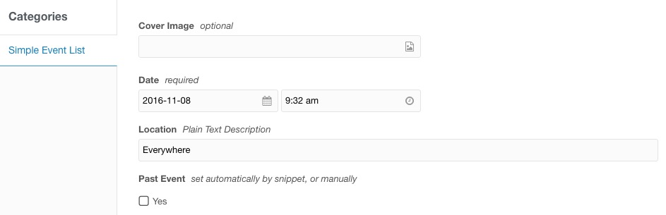

# MODX Simple Event List
Simple Snippets to Drop-in a list of Upcoming and Past Events.

## Installation

1. Install Package
2. Assign the 4 Template Variables to a Template for a **Single Event Page**
3. Build a Single Event Page (child)
4. Build an Event Listing Page (parent)

---



---

### Event Listing Page

```
<h2>Upcoming Events</h2>
[[SimpleEventsUpcoming]]
<br>
<h2>Past Events</h2>
[[SimpleEventsPast]]
```

---

> The output is basic `<ul><li></li></ul>` markup

- included the `cover` Template Variable. You can add it to the row output if you want.
- You can also manually check the `Past Event` checkbox if you want to override the automatic date check for some reason.
- Classnames in the output are basic Bootstrap List Items

**It doesn't get much SIMPLER**
